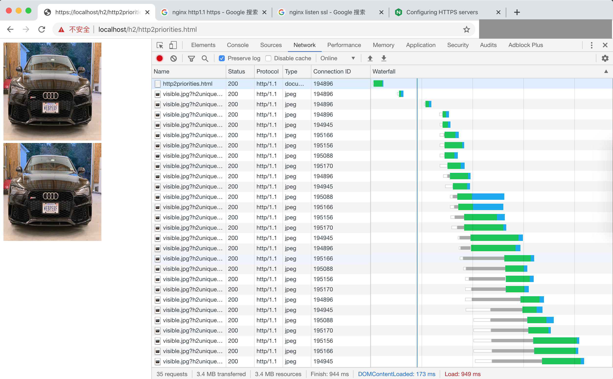
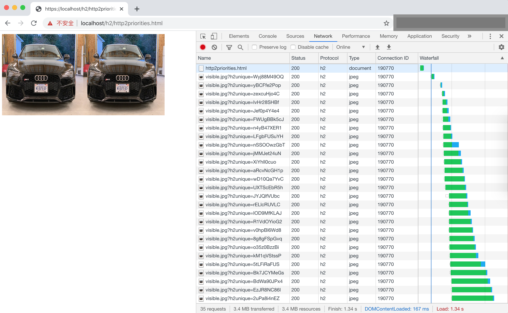

# docker-http2-benchmark

## 1. 签发证书

参考文档[Certificates for localhost](https://letsencrypt.org/docs/certificates-for-localhost/), 为 `localhost`域名签发证书.

执行
``` 
chmod +x create_ssl.sh
./create_ssl.sh
```

将证书 `ssl/localhost.crt` 加入到系统可信证书列表中.

对于 mac 系统, 在Mac上打开“钥匙串访问”，然后转到“系统”中的证书列表，通过点击+号按钮导入证书 `localhost.crt`.

## 2. 搭建 http1 服务环境

```
cd server
mkdir -p log
docker-compose -f docker-compose-http1.yml up -d
```

## 3. 搭建 http2 服务环境

```
cd server
mkdir -p log
docker-compose up -d
```

## 4. 使用 chrome 测试

### 4.1 http1

测试结果:



### 4.2 http2

测试结果:




